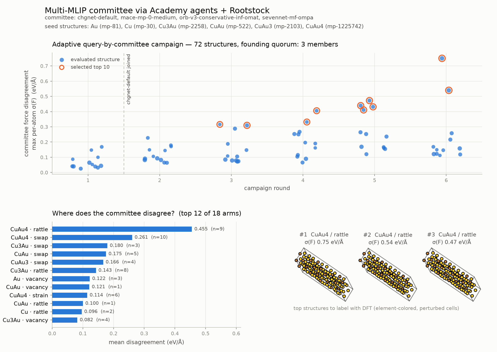
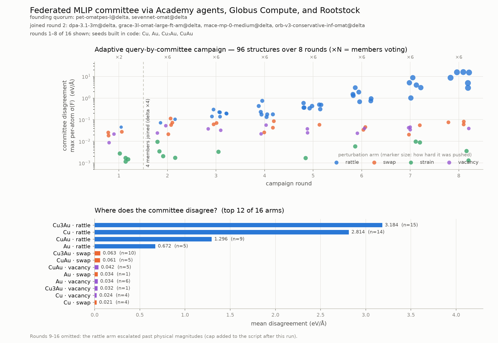

# A self-steering MLIP committee, built from Academy agents and Rootstock

*Demo: autonomous query-by-committee over Cu–Au phases. Single-cluster
version run on NCSA Delta (companion driver for ALCF Sophia included);
federated version, one file run with `hog run` against facility Globus
Compute endpoints, in the last section.*

## Why would a scientist care?

Machine-learned interatomic potentials (MLIPs) like MACE, CHGNet, Orb, and
SevenNet make DFT-quality force predictions a million times faster than DFT —
but each one is quietly wrong somewhere, and it won't tell you where. A cheap
trick from active learning fixes that: ask **several independently-trained
models the same question**. Where they agree, any of them is probably fine.
Where they *disagree*, at least one of them is wrong — and that structure is
exactly the one worth spending real DFT on, because labeling it teaches the
models the most.

This demo runs that idea as an autonomous campaign. It pulls the known stable
phases of the Cu–Au system from the Materials Project (fcc Cu and Au, plus
the classic L1₂/L1₀ ordered intermetallics), then perturbs them — thermal
rattling, strain, vacancies, antisite swaps along the order–disorder story —
and asks a committee of four foundation MLIPs to score every candidate. The
campaign *steers itself*: perturbation families that produce disagreement get
sampled harder and pushed further each round. The output is a ranked shortlist
of "label these with DFT first" structures, with full Materials Project
provenance.

In the run shown below, the committee agreed comfortably on the elements and
the textbook intermetallics, but diverged by up to **0.75 eV/Å** on rattled
configurations of the dilute CuAu₄ phase — the least symmetric,
most thermodynamically marginal seed. That is a sensible answer arrived at
with zero human steering, in about half an hour of one GPU node.

## Why Rootstock?

A committee is only useful if its members are independent — which means four
MLIPs from four different research groups, with four mutually incompatible
Python stacks (different PyTorch pins, fairchem vs. matgl vs. e3nn lineages).
Installing them into one environment ranges from painful to impossible, and
per-user conda environments on HPC are their own tax.

Rootstock dissolves the problem: each MLIP lives in its own **pre-built
environment** on the cluster's shared filesystem, maintained centrally and
verified continuously. A user-side calculator speaks to each model through an
ASE-compatible interface, running the model in an isolated worker subprocess.
Four incompatible models coexist in one Python script:

```python
calc = RootstockCalculator(checkpoint="mace-mp-0-medium", cluster="delta")
```

Better still, the install's manifest records which checkpoints are currently
*verified* on each cluster — so the demo assembles its committee from models
that are actually known-good there, and the identical script runs on Delta or
Sophia by changing one flag.

## Why Academy?

The naive way to use four models is a loop: load model, score structures,
unload, repeat. But model loading is the expensive part (minutes on a cold
node), the models are independent (they should score in parallel), and the
campaign logic should keep running regardless of which models are ready.
That is an actor problem, and [Academy](https://docs.academy-agents.org)
is the actor framework:

- **Each MLIP is a stateful agent** that loads its model once at startup and
  then answers `evaluate_batch` requests from a warm calculator, forever.
- **The committee scores concurrently** — one `asyncio.gather` across agent
  handles fans a batch out to every model at once.
- **The Curator is an autonomous agent** (`@loop`) that proposes, scores,
  adapts, and terminates on its own; the driver just watches its `status()`.
- **The committee is elastic.** Model warm-up on a cold parallel filesystem
  can take ~20 minutes, so the campaign starts as soon as a **quorum** of
  members is ready; late models join mid-campaign (the run below started with
  3 members and seated chgnet during round 1), and a member that fails is
  dropped without stopping the science.

Nothing in the science code knows about any of this machinery — and because
structures cross agent boundaries as plain data, swapping Academy's
same-process exchange for a distributed one (Redis, ProxyStore) would scale
the same committee across nodes or facilities without touching the workflow.

## The demo

Lightly abridged — the full script
([`academy_mlip_committee.py`](academy_mlip_committee.py)) adds a `--mock`
mode (EMT stand-ins with per-member bias) that runs the identical agent
topology on a laptop. Seeds come from
[`fetch_mp_structures.py`](fetch_mp_structures.py), a one-time Materials
Project query cached to `mp_seeds.extxyz`; cluster drivers are
[`academy_committee_delta.sbatch`](academy_committee_delta.sbatch) and
[`academy_committee_sophia.pbs`](academy_committee_sophia.pbs).

### Structures as plain data

```python
def atoms_to_payload(atoms: Atoms) -> dict:
    return {
        "numbers": atoms.numbers.tolist(),
        "positions": atoms.positions.tolist(),
        "cell": atoms.cell[:].tolist(),
        "pbc": atoms.pbc.tolist(),
        # Provenance (e.g. mp_id) rides along into reports and output files.
        "info": {k: v for k, v in atoms.info.items()
                 if isinstance(v, (str, int, float, bool))},
    }


def payload_to_atoms(payload: dict) -> Atoms:
    atoms = Atoms(
        numbers=payload["numbers"],
        positions=payload["positions"],
        cell=payload["cell"],
        pbc=payload["pbc"],
    )
    atoms.info.update(payload.get("info", {}))
    return atoms


def load_seeds(path: Path, min_atoms: int = 32) -> dict[str, Atoms]:
    """Read seed frames (from fetch_mp_structures.py) and supercell them."""
    from ase.io import read as ase_read

    seeds: dict[str, Atoms] = {}
    for atoms in ase_read(path, index=":"):
        name = str(atoms.info.get("seed_name", atoms.get_chemical_formula()))
        base, n = name, 2
        while name in seeds:
            name, n = f"{base}-{n}", n + 1
        rep = max(1, math.ceil((min_atoms / len(atoms)) ** (1 / 3)))
        seeds[name] = atoms * (rep, rep, rep)
    return seeds
```

### One agent per MLIP

Each committee member owns one warm `RootstockCalculator` — Rootstock spawns
the model's isolated worker at startup, and every evaluation after that hits
a loaded model. Blocking calculator calls run via `agent_run_sync`, so the
members genuinely evaluate in parallel.

```python
class _RootstockMLIP:
    """One warm RootstockCalculator, reused across every structure we score."""

    def __init__(self, checkpoint: str, root: str, device: str, timeout: float):
        from rootstock import RootstockCalculator

        self._calc = RootstockCalculator(
            checkpoint=checkpoint, root=root, device=device, timeout=timeout
        )

    def evaluate(self, atoms: Atoms) -> tuple[float, np.ndarray]:
        atoms.calc = self._calc
        return float(atoms.get_potential_energy()), atoms.get_forces()

    def close(self) -> None:
        self._calc.close()


class MLIPCommitteeMember(Agent):
    """Wraps one MLIP behind an Academy action interface."""

    def __init__(self, name: str, checkpoint: str, root: str,
                 device: str, timeout: float = 1800.0):
        super().__init__()
        self._name = name
        self._checkpoint = checkpoint
        self._root = root
        self._device = device
        self._timeout = timeout
        self._mlip: _RootstockMLIP | None = None
        self._warmup_s: float | None = None

    def _build_and_warm(self):
        mlip = _RootstockMLIP(self._checkpoint, self._root, self._device,
                              self._timeout)
        # Pay worker spawn + model load now, not inside the first campaign round.
        mlip.evaluate(bulk("Cu", "fcc", a=3.615))
        return mlip

    async def agent_on_startup(self) -> None:
        start = time.monotonic()
        self._mlip = await self.agent_run_sync(self._build_and_warm)
        self._warmup_s = time.monotonic() - start

    async def agent_on_shutdown(self) -> None:
        if self._mlip is not None:
            self._mlip.close()

    @action
    async def info(self) -> dict:
        # Also serves as the readiness barrier: actions aren't processed
        # until agent_on_startup completes, i.e. until the model is warm.
        return {"name": self._name, "checkpoint": self._checkpoint,
                "warmup_s": round(self._warmup_s, 1)}

    def _evaluate(self, payloads: list[dict]) -> list[dict]:
        results = []
        for payload in payloads:
            energy, forces = self._mlip.evaluate(payload_to_atoms(payload))
            results.append({"energy": energy, "forces": forces.tolist()})
        return results

    @action
    async def evaluate_batch(self, payloads: list[dict]) -> list[dict]:
        return await self.agent_run_sync(self._evaluate, payloads)
```

### The Curator: an autonomous active-learning loop

```python
@dataclass
class CampaignConfig:
    rounds: int = 4
    batch_size: int = 12
    top_k: int = 10
    seed: int = 7
    # Pause between rounds; lets slow-warming members join mid-campaign even
    # when evaluation itself is fast.
    round_pause: float = 0.0


@dataclass
class _Arm:
    """One (seed structure, perturbation family) proposal arm."""

    seed_name: str
    transform: str
    magnitude: float
    cap: float
    scores: list[float] = field(default_factory=list)

    @property
    def mean_score(self) -> float:
        return float(np.mean(self.scores)) if self.scores else 0.0


class Curator(Agent):
    """Proposes structures, queries the committee, and chases disagreement.

    Query-by-committee: a structure's score is the largest per-atom standard
    deviation of forces across the committee (eV/Å). High score = the models
    genuinely disagree there = the most informative structure to label with
    DFT and fold into fine-tuning.
    """

    def __init__(self, pool: dict[str, Handle], active: set[str],
                 seed_payloads: dict[str, dict], config: CampaignConfig):
        super().__init__()
        # `pool` holds handles to every launched member, warm or not; only
        # names in `_active` are queried. Stragglers are added via the
        # activate_member action as their models finish loading.
        self._pool = dict(pool)
        self._active = set(active)
        self._joined_round = {name: 0 for name in active}
        self._cfg = config
        self._rng = np.random.default_rng(config.seed)
        self._seeds = {name: payload_to_atoms(p)
                       for name, p in seed_payloads.items()}
        self._arms = self._make_arms()
        self._candidates: list[dict] = []
        self._strikes = {name: 0 for name in pool}
        self._round = 0
        self._status_note = "starting campaign"
        self._done = False
        self._report: dict | None = None

    # -- proposal ----------------------------------------------------------

    def _make_arms(self) -> list[_Arm]:
        arms = []
        for seed_name, atoms in self._seeds.items():
            arms.append(_Arm(seed_name, "rattle", magnitude=0.05, cap=0.35))
            arms.append(_Arm(seed_name, "strain", magnitude=0.02, cap=0.08))
            arms.append(_Arm(seed_name, "vacancy", magnitude=1.0, cap=3.0))
            if len(set(atoms.numbers)) >= 2:
                # Antisite disorder — only meaningful for intermetallics.
                arms.append(_Arm(seed_name, "swap", magnitude=0.1, cap=0.5))
        return arms

    def _apply_transform(self, arm: _Arm) -> Atoms:
        atoms = self._seeds[arm.seed_name].copy()
        rng = self._rng
        if arm.transform == "rattle":
            atoms.positions += rng.normal(0.0, arm.magnitude, atoms.positions.shape)
        elif arm.transform == "strain":
            strain = rng.uniform(-arm.magnitude, arm.magnitude, (3, 3))
            strain = (strain + strain.T) / 2 + np.eye(3)
            atoms.set_cell(atoms.cell[:] @ strain, scale_atoms=True)
            atoms.positions += rng.normal(0.0, 0.02, atoms.positions.shape)
        elif arm.transform == "vacancy":
            n_vac = max(1, int(round(arm.magnitude)))
            keep = rng.choice(len(atoms), size=len(atoms) - n_vac, replace=False)
            atoms = atoms[np.sort(keep)]
            atoms.positions += rng.normal(0.0, 0.03, atoms.positions.shape)
        elif arm.transform == "swap":
            # Composition-preserving antisite pairs: exchange the species of
            # k A-sites with k B-sites (order-disorder along the L1_2/L1_0
            # story), plus a small rattle to break the ideal-lattice symmetry.
            numbers = atoms.numbers.copy()
            species_a, species_b = np.unique(numbers)[:2]
            idx_a = np.flatnonzero(numbers == species_a)
            idx_b = np.flatnonzero(numbers == species_b)
            k = max(1, int(round(arm.magnitude * len(atoms) / 2)))
            k = min(k, len(idx_a), len(idx_b))
            swap_a = rng.choice(idx_a, size=k, replace=False)
            swap_b = rng.choice(idx_b, size=k, replace=False)
            numbers[swap_a], numbers[swap_b] = species_b, species_a
            atoms.set_atomic_numbers(numbers)
            atoms.positions += rng.normal(0.0, 0.03, atoms.positions.shape)
        return atoms

    def _propose(self, round_no: int) -> list[dict]:
        batch_size = self._cfg.batch_size
        if round_no == 0:
            # Survey round: cover every arm evenly.
            picks = [self._arms[i % len(self._arms)] for i in range(batch_size)]
        else:
            # Exploit: sample arms proportional to observed disagreement,
            # with a floor so no arm is starved of exploration.
            weights = np.array([arm.mean_score + 0.02 for arm in self._arms])
            picks = list(self._rng.choice(self._arms, size=batch_size,
                                          p=weights / weights.sum()))
        batch = []
        for i, arm in enumerate(picks):
            batch.append({
                "id": f"r{round_no}-{i:02d}",
                "round": round_no,
                "seed": arm.seed_name,
                "transform": arm.transform,
                "magnitude": round(arm.magnitude, 3),
                "payload": atoms_to_payload(self._apply_transform(arm)),
                "_arm": arm,
            })
        return batch

    # -- scoring -----------------------------------------------------------

    @staticmethod
    def _score(member_results: dict[str, dict]) -> tuple[float, float]:
        forces = np.array([r["forces"] for r in member_results.values()])
        energies = np.array([r["energy"] for r in member_results.values()])
        n_atoms = forces.shape[1]
        per_atom = np.linalg.norm(forces.std(axis=0), axis=1)
        e_spread = float(energies.max() - energies.min()) / n_atoms
        return float(per_atom.max()), e_spread

    # -- the autonomous campaign loop ---------------------------------------

    @action
    async def activate_member(self, name: str) -> None:
        """A late-warming pool member is ready: seat it on the committee."""
        if name in self._pool and name not in self._active:
            self._active.add(name)
            self._joined_round[name] = self._round
            self._status_note = f"{name} joined the committee"

    @loop
    async def campaign(self, shutdown: asyncio.Event) -> None:
        for round_no in range(self._cfg.rounds):
            if shutdown.is_set():
                return
            self._round = round_no + 1
            batch = self._propose(round_no)
            payloads = [c["payload"] for c in batch]

            live = {name: self._pool[name] for name in sorted(self._active)
                    if self._strikes[name] < 2}
            if len(live) < 2:
                self._status_note = "fewer than 2 healthy committee members; aborting"
                break
            results = await asyncio.gather(
                *(handle.evaluate_batch(payloads) for handle in live.values()),
                return_exceptions=True,
            )

            per_member: dict[str, list[dict]] = {}
            for name, result in zip(live, results):
                if isinstance(result, BaseException):
                    self._strikes[name] += 1
                    self._status_note = f"member {name} failed: {result!r}"
                else:
                    self._strikes[name] = 0
                    per_member[name] = result

            best_this_round = None
            for i, cand in enumerate(batch):
                member_results = {name: res[i] for name, res in per_member.items()}
                if len(member_results) < 2:
                    continue
                score, e_spread = self._score(member_results)
                arm = cand.pop("_arm")
                arm.scores.append(score)
                cand["qbc_force_std"] = round(score, 4)
                cand["energy_spread_per_atom"] = round(e_spread, 4)
                cand["energies"] = {n: round(r["energy"], 4)
                                    for n, r in member_results.items()}
                self._candidates.append(cand)
                if best_this_round is None or score > best_this_round["qbc_force_std"]:
                    best_this_round = cand

            # Escalate the winning arm: push harder where models disagree.
            if best_this_round is not None:
                for arm in self._arms:
                    if (arm.seed_name == best_this_round["seed"]
                            and arm.transform == best_this_round["transform"]):
                        arm.magnitude = min(arm.magnitude * 1.35, arm.cap)

            if self._cfg.round_pause:
                await asyncio.sleep(self._cfg.round_pause)

        ranked = sorted(self._candidates, key=lambda c: c["qbc_force_std"],
                        reverse=True)
        self._report = {
            # name -> round it joined (0 = founding quorum member).
            "committee": {n: self._joined_round[n] for n in sorted(self._active)},
            "selected": ranked[: self._cfg.top_k],
            # ... plus arm rankings, per-candidate history, seed provenance —
            # everything visualize_committee.py needs (see the full script).
        }
        self._done = True

    @action
    async def status(self) -> dict:
        return {"round": self._round, "rounds": self._cfg.rounds,
                "members": len(self._active),
                "evaluated": len(self._candidates), "note": self._status_note,
                "done": self._done}

    @action
    async def report(self) -> dict:
        if self._report is None:
            raise RuntimeError("campaign still running")
        return self._report
```

### The driver: quorum start, elastic committee

The pool is resolved from the Rootstock manifest (only checkpoints verified
on *this* cluster are launched), all members warm up in parallel, and the
campaign begins the moment a quorum is ready.

```python
def resolve_committee(root: Path, requested: list[str] | None, size: int) -> list[str]:
    """Pick the committee from checkpoints the manifest says are verified."""
    from rootstock.manifest import is_verified, load_manifest

    manifest = load_manifest(root)
    verified: dict[str, str] = {}  # checkpoint id -> env name
    for env_name, env in manifest.environments.items():
        for ckpt_id, ckpt in env.checkpoints.items():
            if is_verified(env, ckpt):
                verified[ckpt_id] = env_name

    committee, used_envs = [], set()
    for ckpt_id in COMMITTEE_PREFERENCE:
        env = verified.get(ckpt_id)
        if env is not None and env not in used_envs:
            committee.append(ckpt_id)
            used_envs.add(env)
        if len(committee) == size:
            break
    return committee


async def main() -> None:
    # ... CLI parsing elided (see the full script) ...
    seeds = load_seeds(seeds_path)
    root = get_cluster(args.cluster).root
    pool = resolve_committee(root, None, args.pool_size)

    executor = ThreadPoolExecutor(max_workers=len(pool) + 4)
    async with await Manager.from_exchange_factory(
        factory=LocalExchangeFactory(),
        executors=executor,
        log_config=recommended_logging(level="WARNING"),
    ) as manager:
        # Launch the whole pool at once; each member warms its model in
        # agent_on_startup, so the (expensive) model loads run in parallel.
        handles: dict[str, Handle] = dict(zip(pool, await asyncio.gather(*(
            manager.launch(
                MLIPCommitteeMember,
                args=(ckpt, ckpt, str(root), args.device, args.timeout),
                name=ckpt,
            )
            for ckpt in pool
        ))))

        # info() doubles as the per-member readiness signal (actions queue
        # until agent_on_startup completes). A member whose model fails or
        # times out is dropped, not fatal.
        info_tasks = {asyncio.create_task(handles[c].info()): c for c in pool}
        pending, active = set(info_tasks), set()
        while pending and len(active) < args.quorum:
            ready, pending = await asyncio.wait(
                pending, return_when=asyncio.FIRST_COMPLETED)
            active.update(name for name in map(absorb, ready) if name)

        curator = await manager.launch(
            Curator,
            args=(handles, active,
                  {name: atoms_to_payload(atoms) for name, atoms in seeds.items()},
                  CampaignConfig(rounds=args.rounds, batch_size=args.batch_size,
                                 top_k=args.top_k, round_pause=args.round_pause)),
            name="curator",
        )

        while True:
            # Seat stragglers as they warm, and watch the campaign.
            if pending:
                ready, pending = await asyncio.wait(
                    pending, timeout=3, return_when=asyncio.FIRST_COMPLETED)
                for name in (n for n in map(absorb, ready) if n):
                    await curator.activate_member(name)
            status = await curator.status()
            if status["done"]:
                break

        print_report(await curator.report(), args.outdir)
```

## The result

One Delta GPU job (`sbatch academy_committee_delta.sbatch`), 72 structures
over 6 rounds, committee of mace-mp-0-medium, orb-v3, sevennet-mf-ompa, and
chgnet (which joined mid-campaign, one round after the quorum started
without it). Rendered by `visualize_committee.py`:



Reading the figure: **top** — every scored structure by round; marker size
shows how hard the curator was pushing that perturbation family, so the
adaptive escalation is visible as the points grow and climb; the dashed line
marks chgnet joining the committee; orange rings are the final selection.
**Bottom left** — mean disagreement by (seed × perturbation) arm: the
committee is comfortable with the elements and ordered phases but diverges
sharply on rattled and antisite-disordered configurations of the dilute
CuAu₄ phase. **Bottom right** — the top selected structures themselves
(element-colored: gold Au, brown Cu), i.e. the DFT shopping list this
campaign exists to produce.

## Going federated: one file, two facilities

Everything above runs inside a single batch job on one cluster. Nothing in
the campaign requires that: members only ever see plain-data structures
arriving through Academy's exchange, and each member's MLIP is whatever its
local Rootstock install provides. So the natural next step is a committee
whose members live on different HPC facilities, with the campaign driven
from a laptop.

[`federated_mlip_committee.py`](federated_mlip_committee.py) is that
version, and it is a single file you can run today:

```
hog run federated_mlip_committee.py probe -- --sites delta,polaris
hog run federated_mlip_committee.py -- --rounds 8
```

Three tools, each doing one job:

- **[Rootstock](https://github.com/Garden-AI/rootstock)** gives every member
  a warm calculator backed by that cluster's pre-built, verified
  environments. Members are only launched where the install's manifest marks
  the checkpoint verified.
- **[Academy](https://docs.academy-agents.org)** provides the agents and the
  messaging. The Curator runs in the driver process; members connect back
  over Academy's hosted, Globus-authenticated HTTP exchange from wherever
  they run.
- **[groundhog](https://groundhog-hpc.readthedocs.io)** does the deployment.
  Each member agent's whole lifetime is one task on that facility's
  [Globus Compute](https://globus-compute.readthedocs.io) multi-user
  endpoint. groundhog ships the script to the site and builds its Python
  environment there with uv, from the script's own PEP 723 header. Per-site
  scheduler details live in `[tool.hog.<site>]` tables in the same header;
  every key other than `endpoint` is passed through as the endpoint's user
  configuration. Replace the two `account` values with your own allocations
  and the script runs unmodified.

The glue between Academy and groundhog is one class. Academy's `Manager`
launches agents through any `concurrent.futures.Executor`; `GroundhogExecutor`
forwards Academy's agent runner to a `@hog.function` on the site's endpoint:

```python
@hog.function()
def run_task(fn, *args):
    """One Globus Compute task hosts one Academy agent for its whole lifetime."""
    return fn(*args)


class GroundhogExecutor(Executor):
    def __init__(self, site: str):
        self.site = site

    def submit(self, fn, /, *args, **kwargs) -> Future:
        return run_task.submit(fn, *args, endpoint=self.site, **kwargs)
```

Members are named `checkpoint@site`, so the report shows where every opinion
came from.

### What a run looks like

Member start-up is dominated by Rootstock loading a model from a cold
parallel filesystem, and sites have queues, so the campaign starts as soon
as `--quorum` members are ready and seats the rest as they come up.

The run below (2026-09-15) placed six members across two Globus Compute
jobs on NCSA Delta. Two members were warm after about ten minutes and
founded the committee; the other four joined from round 2. Rendered by
[`visualize_federated_committee.py`](visualize_federated_committee.py):



```
08:39:17 READY pet-omatpes-l@delta on gpua076.delta.ncsa.illinois.edu (NVIDIA A100-SXM4-40GB) after 607 s
08:39:18 READY sevennet-omat@delta on gpua076.delta.ncsa.illinois.edu (NVIDIA A100-SXM4-40GB) after 610 s
08:39:18 Campaign starts with 2 members: pet-omatpes-l@delta, sevennet-omat@delta
08:39:22 round 1/16: 12 structures x 2 members; most disagreement 0.045 eV/A on Cu3Au/rattle; ...
08:39:59 READY mace-mp-0-medium@delta on gpua069.delta.ncsa.illinois.edu (NVIDIA A100-SXM4-40GB) after 623 s
08:39:59 JOINED mace-mp-0-medium@delta from round 2
08:40:11 READY dpa-3.1-3m@delta on gpua069.delta.ncsa.illinois.edu (NVIDIA A100-SXM4-40GB) after 633 s
08:40:11 JOINED dpa-3.1-3m@delta from round 2
08:43:08 READY orb-v3-conservative-inf-omat@delta on gpua069.delta.ncsa.illinois.edu (NVIDIA A100-SXM4-40GB) after 811 s
08:43:08 JOINED orb-v3-conservative-inf-omat@delta from round 2
08:44:21 READY grace-3l-omat-large-ft-am@delta on gpua076.delta.ncsa.illinois.edu (NVIDIA A100-SXM4-40GB) after 911 s
08:44:21 JOINED grace-3l-omat-large-ft-am@delta from round 2
08:45:16 round 2/16: 12 structures x 6 members; most disagreement 0.113 eV/A on Cu3Au/swap; ...
```

Two honest caveats about that run. It was meant to span Delta and ALCF
Polaris, but Polaris queue waits exceeded the window, so both jobs landed on
Delta; the Polaris path itself was exercised separately (members ready in
98 to 120 s on 2026-09-11). And the version of the script that ran had no
ceiling on how far the Curator could escalate a perturbation arm, so from
round 9 the rattle amplitude passed physical magnitudes; the figure shows
rounds 1 to 8, and the script now caps each arm (`ARM_CAPS`).

### Facility notes

Both multi-user endpoints needed a `worker_init` in the header, for
different reasons. On Delta, supplying any `worker_init` replaces the
endpoint's default worker bootstrap, so the table rebuilds the worker venv
itself. On Polaris, the endpoint's venv must come first on `PATH` (a
personal Globus Compute install in `~/.local/bin` otherwise shadows it),
`CC=gcc` is needed because the job shell exports `CC=nvc` and Triton cannot
build with it, and outbound traffic must go through the ALCF proxy. The
header carries all of this, so it is documentation as much as configuration.
groundhog 0.9.3 or newer is required.
